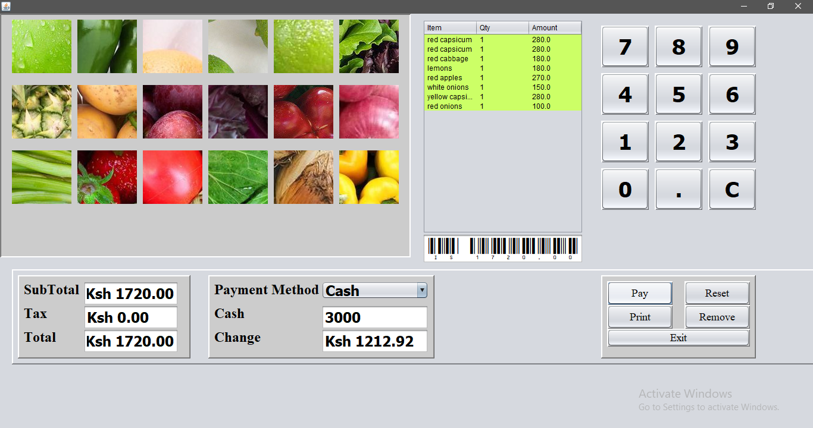

# Point of Sales

Point of Sale Application Developed in Java NetBeans

## Getting Started

Load the project folder on Apache Netbeans compile and run the JavaPOS.java program

### Prerequisites

Java jdk
Apache Netbeans
Download and install Barcode: https://www.dafont.com/code39.font

### Installation
When you build an Java application project that has a main class, the IDE
automatically copies all of the JAR files on the projects classpath to your projects dist/lib folder. The IDE
also adds each of the JAR files to the Class-Path element in the application
JAR files manifest file (MANIFEST.MF).

To distribute this project, zip up the dist folder (including the lib folder)
and distribute the ZIP file.
To run the project load the project folder on Apache Netbeans compile and run the JavaPOS.java program 
To run the project from the command line, follow these steps:

1. Navigate to the `dist` folder in your project directory.
2. Type the following command:

   ```shell
   java -jar "JavaPOS.jar"

## Usage

This is a java point of sales application system that allows you to select and add products automatically calculating the price,remove products from list,input cash and calculate change based on products after payment is made,automatically generate barcode and will print a receipt in pdf form saving it locally.



## Features

-Buttons with pictures of products
-Automatically adds prices after click
-Provision for list of products being selected and products can also be removed from the list.The list shows Item,Quantity and Amount
-Input for cash figure
-Calculates change to give to customer
-Barcode generator
-Prints receipt in pdf form


## Contributing

Contributions are welcome! If you find any issues or have ideas for improvements, feel free to submit a pull request.

## License

This project is licensed under the MIT License .

